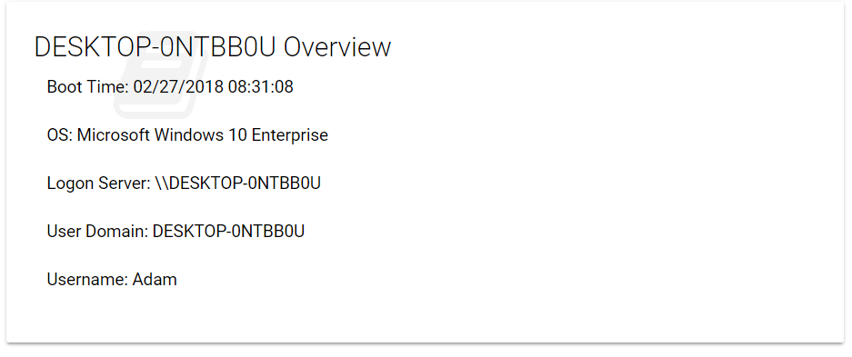
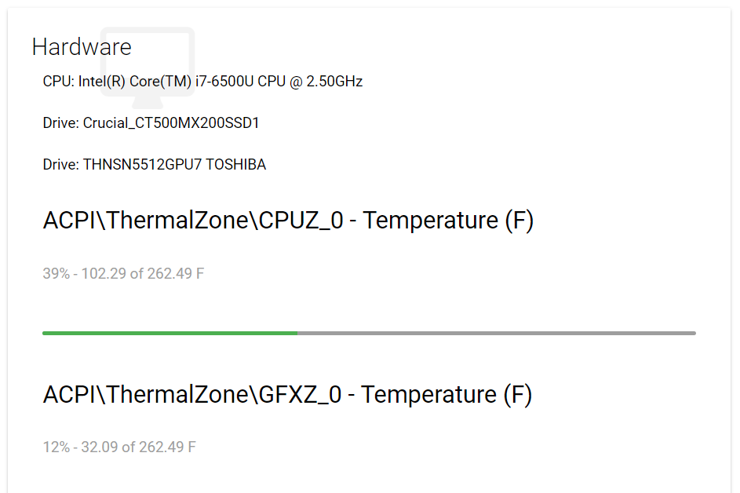
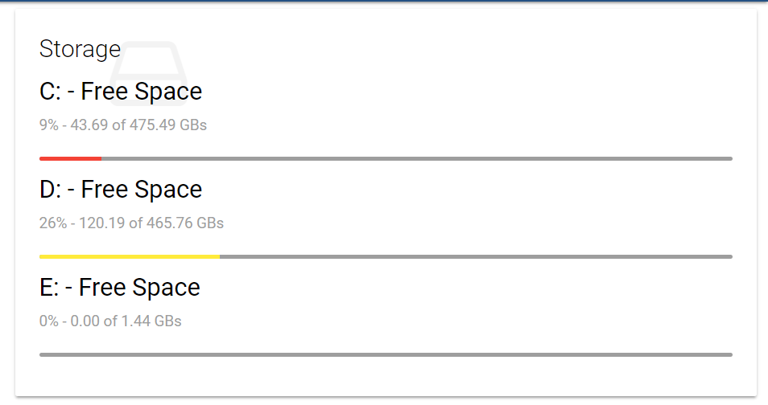
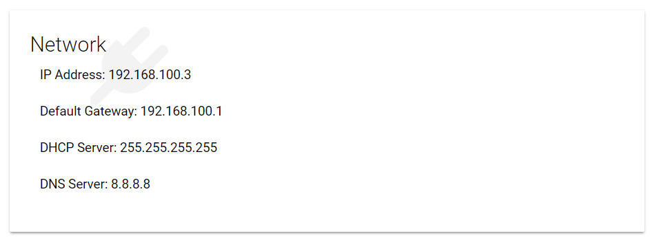

# UDBGInfo

Web-based [BGInfo](https://docs.microsoft.com/en-us/sysinternals/downloads/bginfo) built on [Universal Dashboard](https://ironmansoftware.com/universal-dashboard).

- Lightweight 
- Access from anywhere 
- Updates every 60 seconds

```
Install-Module 'ud-bginfo'
```

## Overview

Basics about a machine. OS version, logon information and boot time.  



## Hardware

Hardware information such as CPU model, drive model and temperature readings.



## Storage

Storage space for each drive. 



## Network

Network information such as IP Address, gateway and DHCP server. 


